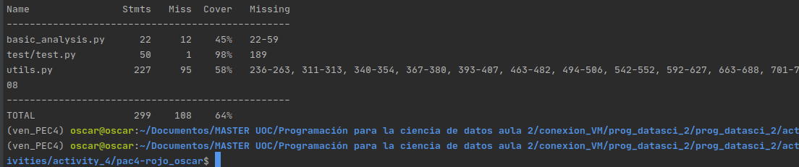
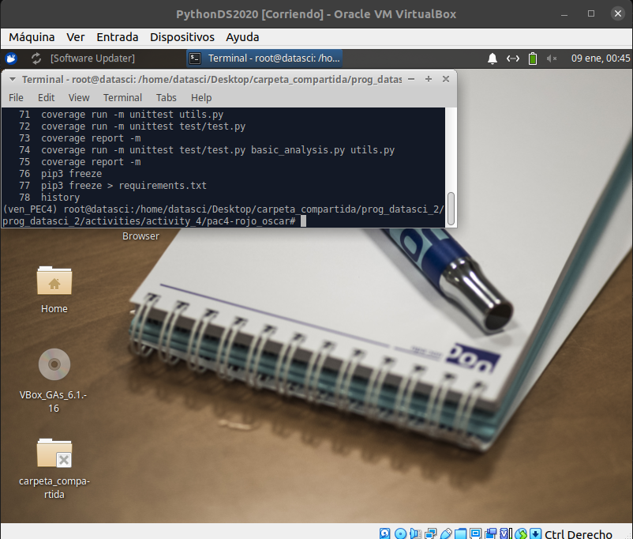
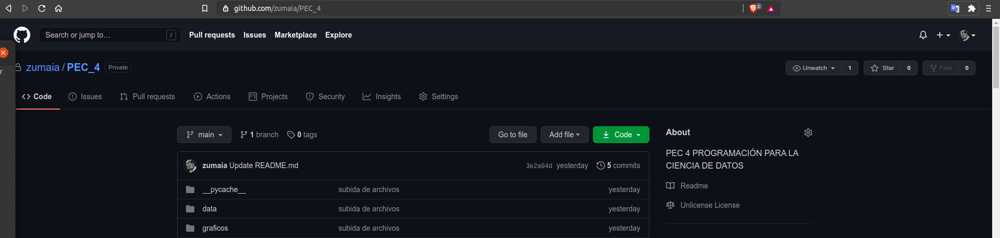
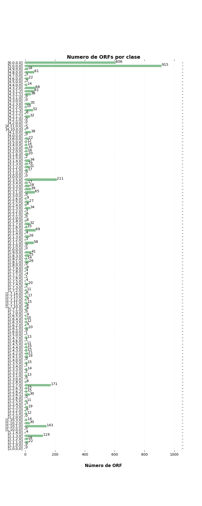
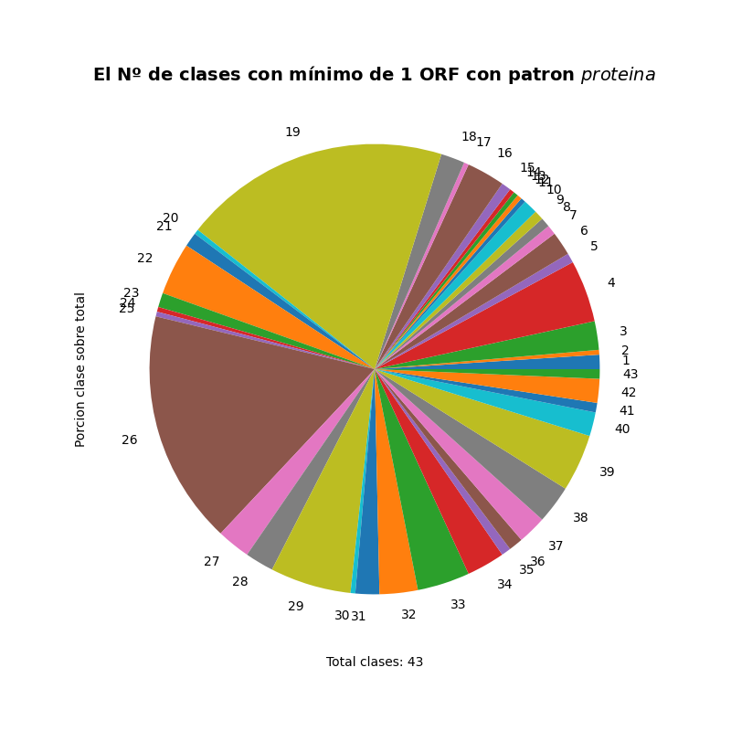
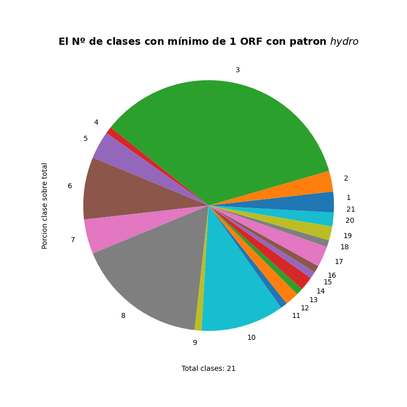
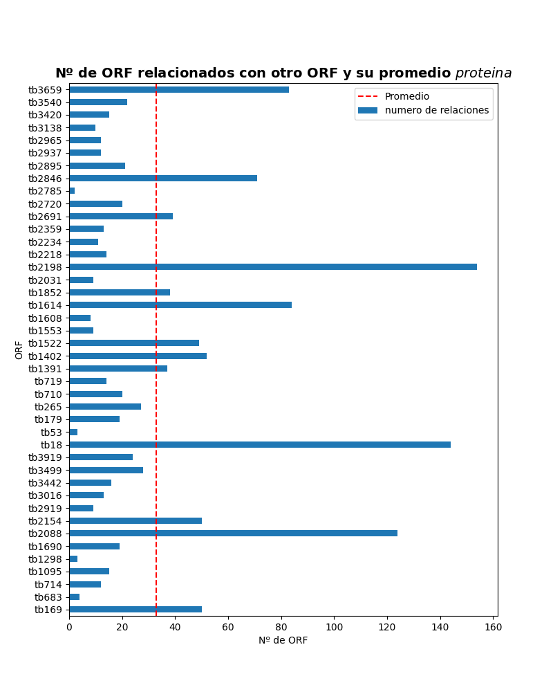
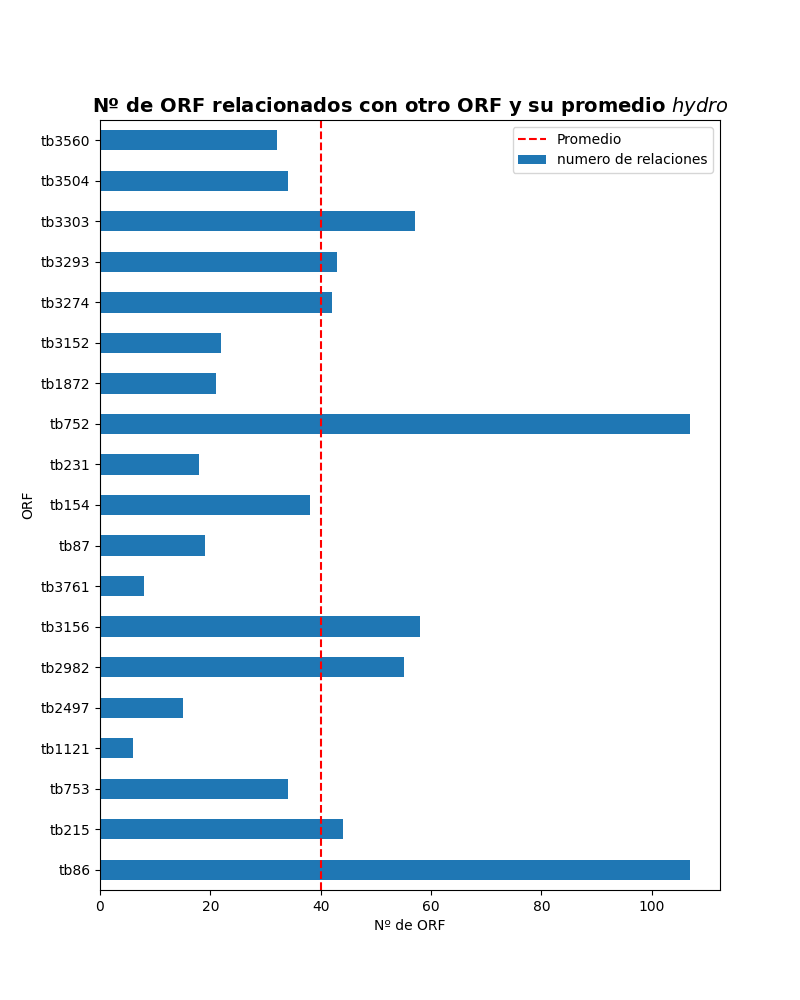
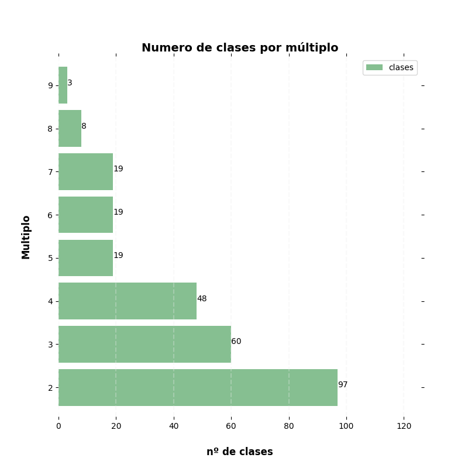

Programación para la ciencia de datos - PEC4

# OSCAR ROJO MARTIN
============================
El presente proyecto trata de resolver una serie de preguntas sobre varios dataset provenientes del repositorio UCI Machine Learning

Delimito 2 tipos diferentes de carga de datos.
El primero engloba el archivo tb_functions.pl
El segundo engloga todos los ficheros txt contenidos dentro de la carpeta orfs.

En lineas generales para ambos ficheros he determinado que la lectura de los mismos se realiza como un fichero plano txt.
En los 2 voy leyendo linea a línea, hago su transformación correspondiente para posteriormente convertirlos en dataframe.

En particular en el primero obtengo el dataframe *df*
Este dataframe lo voy a utilizar para las preguntas 1.1, 1.2, 2.1 y 3

Con respecto al segundo dataframe, es más complejo puesto que primero leo todos los ficheros txt contenidos para posteriormente realizar una lectura de cada linea, seleccioando 5 filas que comienzas por 5 diferentes palabras y utilizando la primera y la última de ellas, genero sublistas. Al final de todo este trabajo obtengo el dataframe *df_total"
Con este dataframe resuelvo la pregunta 2.2.

Todos las preguntas, salvo la 1.2 llevan anexado una gráfica.
Salvo en el apartado 2.1 he optado por utilizar un gráfico de barras mostrando cada uno de los valores obtenido
Para el caso 2.2 he optado el formato de gráfica **pie** ya que en ella he mostrado el resultado completo de la consulta y he añadido la proporción de cada una de los valores que componen el resultado final.

El proyecto está estructurado de la siguiente manera:

pec4-rojo_oscar  
├── basic_analysis.py  
├── data  
│   ├── orfs  
│   └── tb_functions.pl  
├── ES-PEC4-enun.ipynb  
├── graficos  
│   ├── clases_multiplo.png  
│   ├── grafica_patron_hydro.png  
│   ├── grafica_patron_proteina.png  
│   ├── grafica_relaciones_patron_hydro.png  
│   ├── grafica_relaciones_patron_proteina.png  
│   └── numero_ORF.png   
├── __init__.py  
├── LICENSE.md    
├── pdf  
│   ├── CAT-PAC4-enun.pdf  
│   ├── ES-PEC4-enun1 .pdf  
│   └── ES-PEC4-enun.pdf  
├── PEC4-Oscar_Rojo.ipynb  
├── __pycache__  
│   ├── basic_analysis.cpython-38.pyc  
│   └── utils.cpython-38.pyc  
├── README.md  
├── requirements.txt  
├── test  
│   ├── __init__.py  
│   ├── __pycache__  
│   └── test.py  
├── utils.py  
└── ven_PEC4  
    ├── bin  
    ├── etc  
    ├── include  
    ├── lib  
    ├── lib64 -> lib  
    ├── pyvenv.cfg  
    └── share  
  

El fichero adjunto en formato comprimido contiene estos ficheros:
pec4-rojo_oscar
├── basic_analysis.py  
├── graficos  
│   ├── clases_multiplo.png  
│   ├── grafica_patron_hydro.png  
│   ├── grafica_patron_proteina.png  
│   ├── grafica_relaciones_patron_hydro.png  
│   ├── grafica_relaciones_patron_proteina.png  
│   └── numero_ORF.png  
├── __init__.py  
├── LICENSE.md  
├── PEC4-Oscar_Rojo.ipynb  
├── README.md  
├── requirements.txt  
├── test  
│   ├── __init__.py  
│   ├── __pycache__  
│   └── test.py  
├── utils.py    

Básicamente se excluyen el directorio ven_PEC4 ya que es el entorno virtual que hay que crear en la carpeta donde se guarden todos estos archivos
Se elimina tambien las carpetas pdf, data y el enunciado, ya que es lo que se ha aportado desde el profesorado.

============================

Comenzamos a trabajar con los ficheros

1 - Se descarga el archivo comprimido en una nueva carpeta, totalmente vacia.  

2 - En dicha carpeta se descarga genera un entrono virtual para aislar nuestro proyecto de otros proyectos y tener un control sobre los paquetes que se instalen y sus correspondientes versiones.  El nombre puede ser cualquiera, para la confección del ejercicio indique **ven_PEC4**   

3 - Una vez generado el entrono virtual se activa con:   

	$ source ven_PEC4/bin/activate  
	
4 - Tras activar es necesario instalar los paquetes asociados con este proyecto. Dichos paquetes con sus correspondintes versiones se encuentran alojados en el fichero requirements.txt. Es necesario ejecutar  

	$ pip3 install -r requirements.txt  
	
5 - Por último no nos queda más que ejecutar el programa con la siguiente orden   

	$ python3 basic_analysis.py  
	
Una vez ejecutado, el programa generará automáticamete las ordenes indicadas y mostrará en pantalla las gráficas y guardará dichas gráficas en la carpeta gráficos.

**basic_analysis.py** contiene la ejecución de todas las función que se han programado y guardado en la fichero utils.py, desde la recolección de los datos, su transformación y la representación de los resultados.

Por último para testear el programa se ha generado un fichero test.py dentro de la carpeta test. 
Para ejecutarlo hay que indicar la siguiente orden:  

	$ coverage run -m unittest test/test.py basic_analysis.py utils.py 
	
Y para la medición de la cobertura de los test hay que ejecutar la orden: 

	$ coverage report -m test/test.py basic_analysis.py utils.py
	
En este caso en particular la cobertura ha sido del 64%




============================

Para generar este proyecto se han utilizado lo siguiente:
* S.O. Ubuntu 20.04
* Jupyter Lab 
* Sublime Text
* Pycharm Profesional 2020.1, que es grátis para estudiantes.

El ejercicio se ha probado en la máquina virtual suministrada, con el mismo resultado.




============================

Para guardar el proyecto y controlar las versiones, se ha utilizado Github

Este proyecto se ha guardado en Github en el repoitorio **github.com/zumaia/PEC_**



============================

Por último: represento un resumen del trabajo que se obtiene ejecutando la orden

	$ python3 basic_analysis.py
	
============================


# Los datos

Los datos a analizar nos son proporcionados en dos colecciones de datos separadas: `tb_functions.pl` y `orfs/tb_data_0x.pl`. Estos datos provienen del [repositorio UCI Machine Learning](https://archive.ics.uci.edu/ml/datasets/m.+Tuberculosis+Genes) y tienen formado de *datalog*.

## tb_functions.pl
`tb_functions.pl` contiene información general sobre los genes y sus clases funcionales. Mientras que `tb_data_0X.pl` contiene información detallada sobre todos los genes indicados.

Donde hay dos tipos de entrada:

`class`: tiene 2 elementos separados por comas siempre presentados en el siguiente orden:
* *identificador de la clase*: lista de 4 números que describe la clase en 4 dimensiones diferentes (separados por comas y entre corchetes), y
* *descripción de la clase*: string que contiene la descripción de la clase, ninguna clase comparte descripción con otra clase (string entre comillas dobles).

`function`: tiene 4 elementos separados por comas siempre presentados en el siguiente orden:
* *ORF*: pauta abierta de lectura (en inglés *open reading frame*) (string sin comillas),
* *identificador de la clase*: lista de 4 números que describe la clase en 4 dimensiones diferentes (separados por comas y entre corchetes),
* *nombre del gen*: nombre del gen o valor *null* si el gen no tiene nombre (string entre comillas simples), y
* *descripción ORF*: descripción de la pauta de lectura (string entre comillas dobles).

## tb_data_0X.pl
Los archivos `tb_data_0X.pl` tienen la siguiente estructura:

Donde los datos para un único ORF están capturados entre los delimitadores:
```
begin(model(ORF))
end(model(ORF))
```
Y el atributo `tb_tono_tb_evalue(ORF, E-value)` muestra la relación con otros ORFs.

# Ejercicio

## Carga fichero "tb_functions.pl"

En este apartado cargo el fichero tb_functions.pl leyendo linea a lines, realizando unas transformaciones y generando el dataframe **df**

## Carga fichero "tb_functions.pl"


1.1 Calcular cuántos ORFs pertenecen a cada clase. 





1.2 Dado que el Bacilo de Koch afecta sobre todo a los pulmones, queremos que mostréis por pantalla cuántos ORFs pertenecen a la clase que tiene Respiration como descripción. Mostrad el resultado por pantalla debidamente formateado (utilizando el método format() u otro similar), incluyendo un mensaje explicativo de los valores que enseñáis.


    El Nº de ORF incluidos en la clase con descripción 'Respiration' es: 0 
    
    

2. Para cada patrón listado`*`, calcular:
    <br>2.1 El número de clases que contienen como mínimo un ORF con el patrón indicado en su descripción.
    <br>2.2 El número promedio de ORFs con los cuales se relacionan los ORFs con el patrón indicado en su descripción.<br><br>
    `*` Los patrones para los cuales tendréis que resolver los cálculos 2.1 y 2.2 son:
    - La descripción contiene el término *protein*. Por ejemplo, el ORF con descripción *electron transfer flavoprotein alpha subunit* encajaría con esta definición.
    - La descripción contiene una palabra de 13 caracteres y esta contiene el término *hydro*. Por ejemplo, el ORF con descripción *3-hydroxyacyl-CoA dehydrogenase* encajaría con esta definición.<br>


    El número de clases que contienen como mínimo un ORF con el patron 'que contiene el término protein'.  43 
    
 




    El número de clases según el segundo patron es 21





2.2 El número promedio de ORFs con los cuales se relacionan los ORFs con el patrón indicado en su descripción.


    El número promedio de ORFs con los cuales se relacionan losORFs con el patron 'que contiene el término protein'. 32.833333333333336





    El número promedio de ORFs con los cuales se relacionanlos ORFs según el segundo patron es: 40.0 





3. Para cada entero M entre 2 y 9 (ambos incluidos), calcula el número de clases que tienen como mínimo una *dimensión* mayor estricta (>) que 0 y a la vez múltiple de M. Con el término dimensión nos referimos a cada uno de los 4 números que forman el identificador de la clase (explicado en la sección anterior). Este cálculo tendrá que resultar en algo como:
```
M=2: ? clases
M=3: ? clases
...
M=9: ? clases
``` 
donde ? representa un entero.


    M = 2:  97 clases
    M = 3:  60 clases
    M = 4:  48 clases
    M = 5:  19 clases
    M = 6:  19 clases
    M = 7:  19 clases
    M = 8:  8 clases
    M = 9:  3 clases



